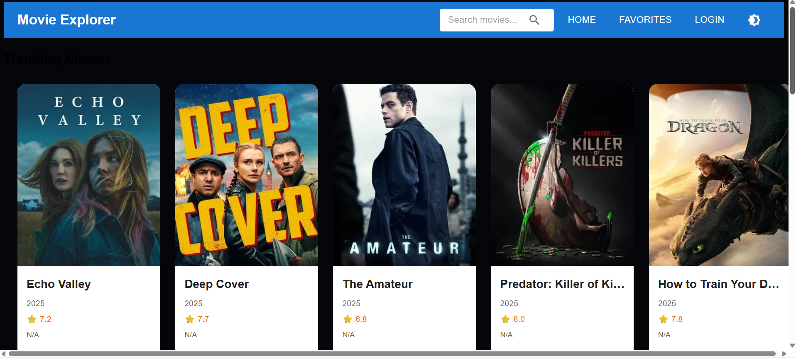
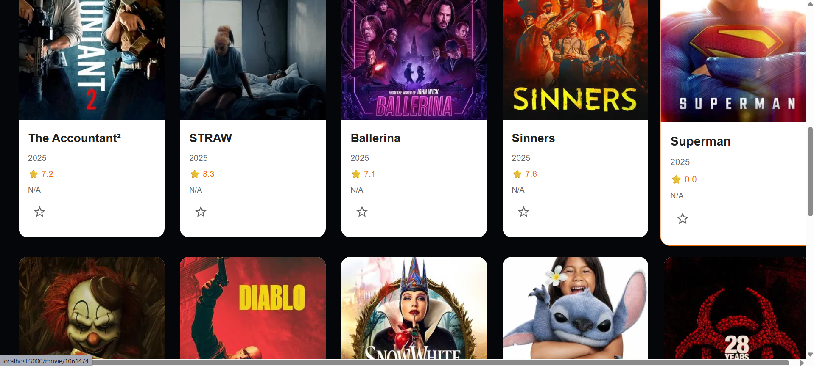
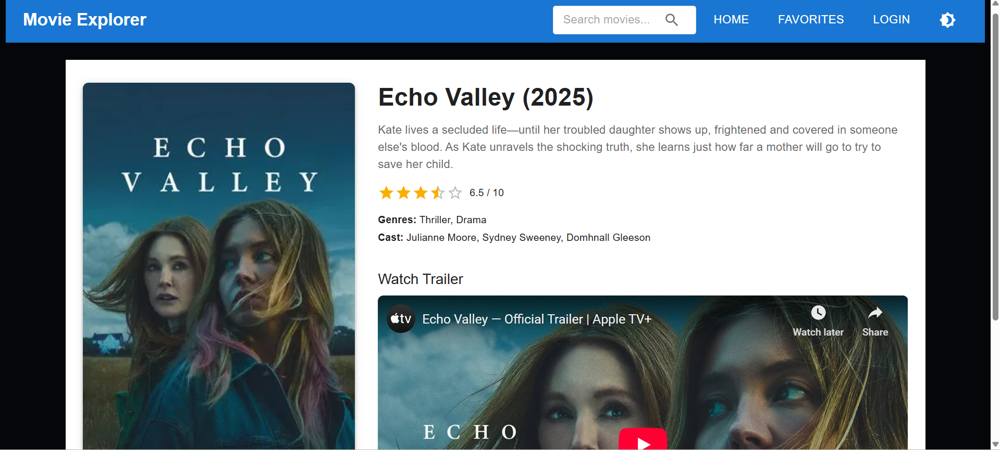
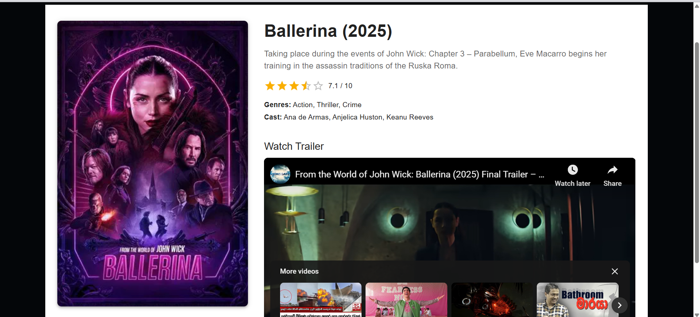
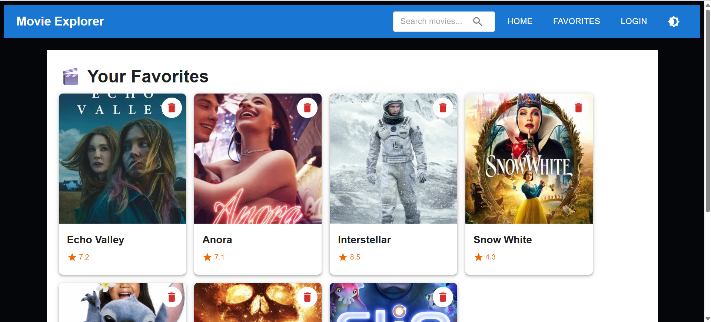
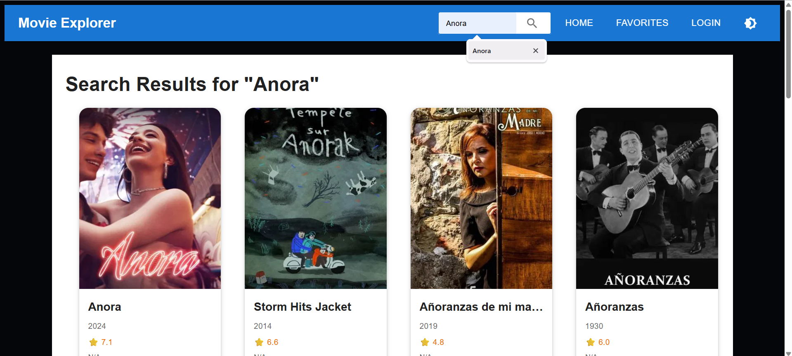
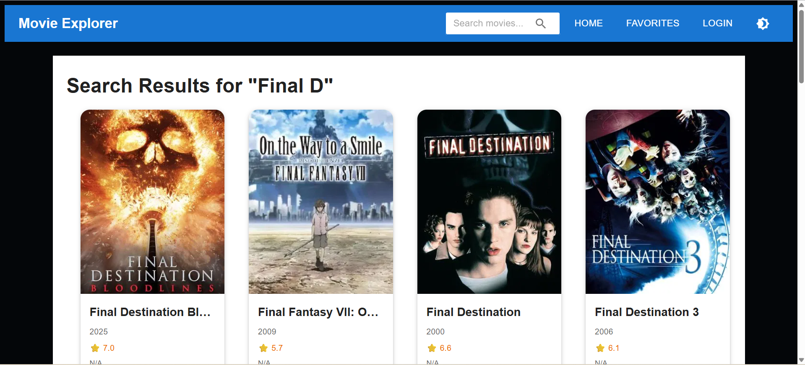
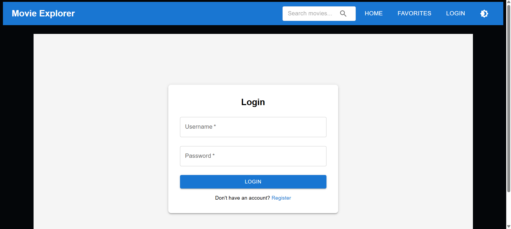
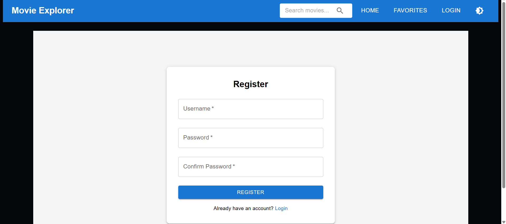

# 🎬 MovieExplorer

A full-stack movie discovery application that allows users to explore movies, manage favorites, and enjoy a personalized movie browsing experience.


## 🎯 Overview

MovieExplorer is a modern web application that provides users with an intuitive interface to discover movies using The Movie Database (TMDB) API. The application features user authentication, personalized favorites management, and a responsive design that works seamlessly across all devices.

## ✨ Features

### Frontend Features
- 🔍 **Movie Search**: Search for movies using TMDB API
- 🎬 **Movie Details**: View detailed information about movies including ratings, genres, and descriptions
- ⭐ **Favorites Management**: Add/remove movies to/from personal favorites list
- 📱 **Responsive Design**: Mobile-first design using Material-UI
- 🎨 **Modern UI**: Clean and intuitive user interface with hover effects and animations
- 🔐 **User Authentication**: Login and registration system
- 👤 **User Profile**: Personal profile management
- 🌙 **Theme Support**: Dark/Light theme support

### Backend Features
- 🔐 **JWT Authentication**: Secure token-based authentication
- 👥 **User Management**: Registration, login, and profile management
- 🗄️ **Entity Framework Core**: Database operations with SQL Server
- 🔑 **ASP.NET Core Identity**: Robust user identity management
- 📊 **API Documentation**: Swagger/OpenAPI documentation
- 🌐 **CORS Enabled**: Cross-origin resource sharing for frontend integration

## 🖼️ User Interfaces

Home Page

<p align="center">  </p>

<p align="center">  </p>

Movie Details 
<p align="center">  </p>
<p align="center">  </p>

Add Favorites Functionality 

<p align="center">  </p>

Search Functionality 

<p align="center">  </p>
<p align="center">  </p>
Login

<p align="center">  </p>

Register 

<p align="center">  </p>

## 🛠️ Tech Stack

### Frontend
- **React 19.1.0** - Modern JavaScript library for building user interfaces
- **Material-UI 7.1.0** - React components implementing Google's Material Design
- **React Router DOM 7.6.0** - Declarative routing for React
- **Axios 1.9.0** - HTTP client for API requests
- **React Hooks** - State management and side effects

### Backend
- **ASP.NET Core 8.0** - Cross-platform web framework
- **Entity Framework Core 8.0** - Object-relational mapping (ORM)
- **ASP.NET Core Identity** - User authentication and authorization
- **SQL Server** - Relational database management system
- **JWT Bearer Authentication** - JSON Web Token authentication
- **Swagger/OpenAPI** - API documentation and testing

### External APIs
- **TMDB API** - The Movie Database API for movie data

## 📋 Prerequisites

Before running this application, make sure you have the following installed:

- **Node.js** (v16.0 or later)
- **npm** (v8.0 or later)
- **.NET 8.0 SDK**
- **SQL Server** (LocalDB or full version)
- **Visual Studio 2022** or **VS Code** (recommended)

## 🚀 Installation

### 1. Clone the Repository
```bash
git clone https://github.com/JMAdikari/MovieExplorer-Backend.git
cd MovieExplorer-Backend
```

### 2. Backend Setup

#### Navigate to Backend Directory
```bash
cd Back-end
```

#### Restore NuGet Packages
```bash
dotnet restore
```

#### Update Database
```bash
dotnet ef database update
```

### 3. Frontend Setup

#### Navigate to Frontend Directory
```bash
cd ../Front-end
```

#### Install Dependencies
```bash
npm install
```

## ⚙️ Configuration

### 1. Backend Configuration

#### Update `appsettings.json` and `appsettings.Development.json`:
```json
{
  "ConnectionStrings": {
    "DefaultConnection": "Server=(localdb)\\mssqllocaldb;Database=MovieExplorerDB;Trusted_Connection=true;MultipleActiveResultSets=true"
  },
  "Jwt": {
    "Key": "your-super-secret-jwt-key-here-make-it-long-and-complex",
    "Issuer": "MovieExplorer",
    "Audience": "MovieExplorerUsers",
    "ExpireHours": 24
  }
}
```

### 2. Frontend Configuration

#### Create `.env` file in the Frontend directory:
```env
REACT_APP_TMDB_API_KEY=your_tmdb_api_key_here
REACT_APP_API_BASE_URL=https://localhost:7000/api
```

#### Get TMDB API Key:
1. Visit [TMDB Website](https://www.themoviedb.org/)
2. Create an account
3. Go to Settings → API
4. Request an API key
5. Add the key to your `.env` file

## 🏃‍♂️ Running the Application

### 1. Start the Backend Server
```bash
cd Back-end
dotnet run
```
The backend will be available at `https://localhost:7000`

### 2. Start the Frontend Development Server
```bash
cd Front-end
npm start
```
The frontend will be available at `http://localhost:3000`

### 3. Access the Application
- **Frontend**: http://localhost:3000
- **Backend API**: https://localhost:7000
- **Swagger Documentation**: https://localhost:7000/swagger

## 🔌 API Endpoints

### Authentication Endpoints
- `POST /api/auth/register` - User registration
- `POST /api/auth/login` - User login
- `GET /api/auth/profile` - Get user profile (Protected)
- `PUT /api/auth/profile` - Update user profile (Protected)

### Example API Request
```javascript
// Register User
POST /api/auth/register
{
  "email": "user@example.com",
  "password": "Password123!",
  "fullName": "John Doe"
}

// Login User
POST /api/auth/login
{
  "email": "user@example.com",
  "password": "Password123!"
}
```

## 📁 Project Structure

```
MovieExplorer-Backend/
├── Back-end/                          # ASP.NET Core Backend
│   ├── Controllers/                   # API Controllers
│   │   └── AuthController.cs         # Authentication controller
│   ├── Data/                         # Database context
│   │   └── ApplicationDbContext.cs   # EF Core context
│   ├── Models/                       # Data models
│   │   └── User.cs                   # User entity
│   ├── Services/                     # Business logic
│   │   ├── IAuthService.cs          # Auth service interface
│   │   └── AuthService.cs           # Auth service implementation
│   ├── Migrations/                   # Database migrations
│   ├── Properties/                   # Launch settings
│   ├── Program.cs                    # Application entry point
│   └── appsettings.json             # Configuration settings
│
├── Front-end/                        # React Frontend
│   ├── public/                       # Static files
│   ├── src/
│   │   ├── Api/                      # API configuration
│   │   │   ├── authApi.js           # Authentication API calls
│   │   │   ├── axiosConfig.js       # Axios configuration
│   │   │   └── tmdb.js              # TMDB API configuration
│   │   ├── Components/              # Reusable components
│   │   │   ├── MovieCard.js         # Movie card component
│   │   │   ├── MovieList.js         # Movie list component
│   │   │   ├── Navbar.js            # Navigation component
│   │   │   ├── SearchBar.js         # Search component
│   │   │   └── SearchResult.js      # Search results component
│   │   ├── Pages/                   # Page components
│   │   │   ├── Home.js              # Home page
│   │   │   ├── MovieDetails.js      # Movie details page
│   │   │   ├── Favorites.js         # Favorites page
│   │   │   ├── Login.js             # Login page
│   │   │   ├── Register.js          # Registration page
│   │   │   └── Profile.js           # User profile page
│   │   ├── Services/                # Frontend services
│   │   │   └── MovieService.js      # Movie-related services
│   │   ├── App.js                   # Main app component
│   │   └── index.js                 # App entry point
│   ├── package.json                 # NPM dependencies
│   └── README.md                    # Frontend documentation
│
└── README.md                        # This file
```

## 🖼️ Key Components

### MovieCard Component
- Displays movie information in a card format
- Favorite toggle functionality
- Responsive design with hover effects
- Material-UI styling

### Authentication System
- JWT-based authentication
- Secure password hashing
- User registration and login
- Protected routes

### Movie Search & Discovery
- Integration with TMDB API
- Real-time search functionality
- Movie details with ratings and genres
- Responsive movie listings


## 🐛 Troubleshooting

### Common Issues

1. **CORS Error**: Make sure the backend CORS policy allows the frontend origin
2. **Database Connection**: Verify SQL Server is running and connection string is correct
3. **TMDB API**: Ensure your API key is valid and not rate-limited
4. **JWT Token**: Check if the JWT secret key is properly configured

## 👨‍💻 Author

**JMAdikari**
- GitHub: [@JMAdikari](https://github.com/JMAdikari)


**Happy Movie Exploring! 🎬✨**
